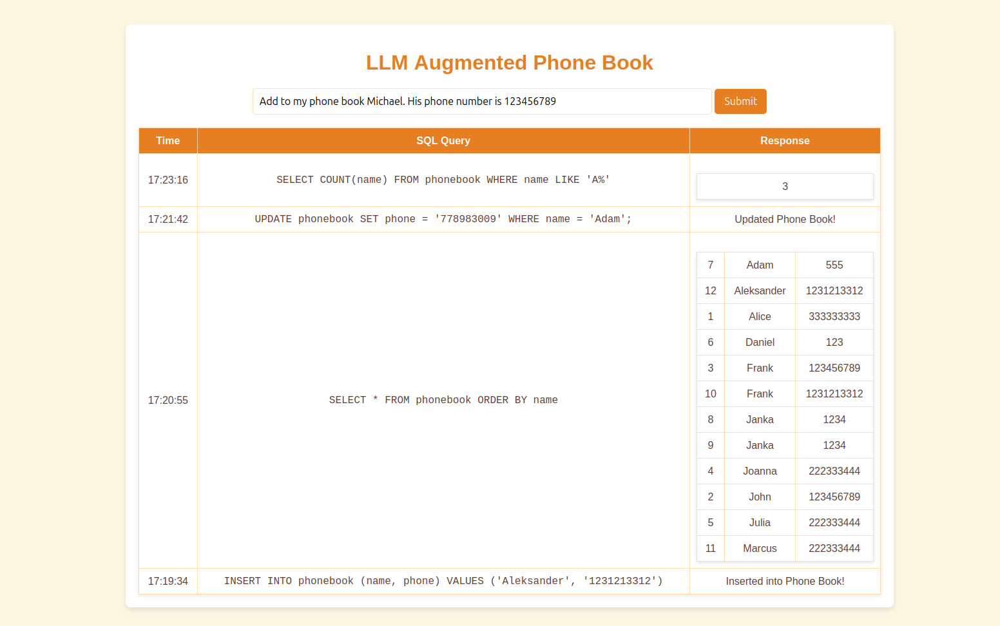

# LLM Augmented Phone Book

A web application that allows users to manage their contacts through natural language commands. Users can add, edit, delete, and retrieve contact records, all while interacting with a simple, intuitive interface. This application leverages a Large Language Model (LLM) to convert natural language into SQL queries, making it easy for users to interact with the phone book without writing SQL themselves.



## Features

- **Add Contact**: Users can add new contact records with names and phone numbers.
- **Edit Contact**: Modify an existing contact’s information.
- **Delete Contact**: Remove a contact from the phone book.
- **Retrieve Contacts**: Query the phone book to fetch contact details or the entire list of contacts.
- **Natural Language Processing (NLP)**: Use an LLM to interpret user commands and convert them into SQL queries for interaction with the database.

## Requirements

- Python 3.x
- Flask
- SQLite3
- Ollama ( llama3.2 model used )
- Flask-SCSS

## Installation

1. Clone the repository:
    ```bash
    git clone git@github.com:fpietru/LLMAPB.git
    cd LLMAPB
    ```

2. Install [Ollama](https://ollama.com/)

3. Install llama3.2
    ```bash
    ollama run llama3.2
    ```

4. Install the required dependencies:
    ```bash
    pip install -r requirements.txt
    ```

5. Start the Flask application:
    ```bash
    python app.py
    ```

6. Access the application at `http://127.0.0.1:5000/`.

### Example Prompts

Here are some example commands you can enter in the input field:

- **Add Contact**: 
    - "Add to my phone book John. His phone number is 123456789."
    - "Please add a record for Joanna with the number 222333444."
  
- **Retrieve Contact**:
    - "What is the phone number for Joanna?"
    - "Show me full phone book."

- **Delete Contact**:
    - "Delete John from my phone book."
    - "Remove Joanna's contact."

- **Update Contact**:
    - "Update Joanna's phone number to 555666777."

### Database Schema

The phone book stores the following fields in an SQLite database:
- **id**: Unique identifier for each contact (integer, primary key).
- **name**: The contact's name (text, not null).
- **phone**: The contact's phone number (text, not null).

## Folder Structure

```
.
├── app.py              # Main application file
├── text2sql.py         # NLP to SQL conversion logic
├── templates/          # HTML templates
│   └── index.html      # Main webpage
│   └── base.html       # Base for index.html
├── static/             # Static files
│   └── style.scss      # Stylesheet for the app
├── requirements.txt    # Python dependencies
└── phonebook.db        # SQLite database (automatically created)
```

## License

This project is open-source and available under the [MIT License](LICENSE).

## Acknowledgements

- [Flask](https://flask.palletsprojects.com/) for the web framework.
- [SQLite](https://www.sqlite.org/) for the database.
- [Ollama](https://ollama.com/) for the LLM-based NLP model used to process natural language into SQL queries.